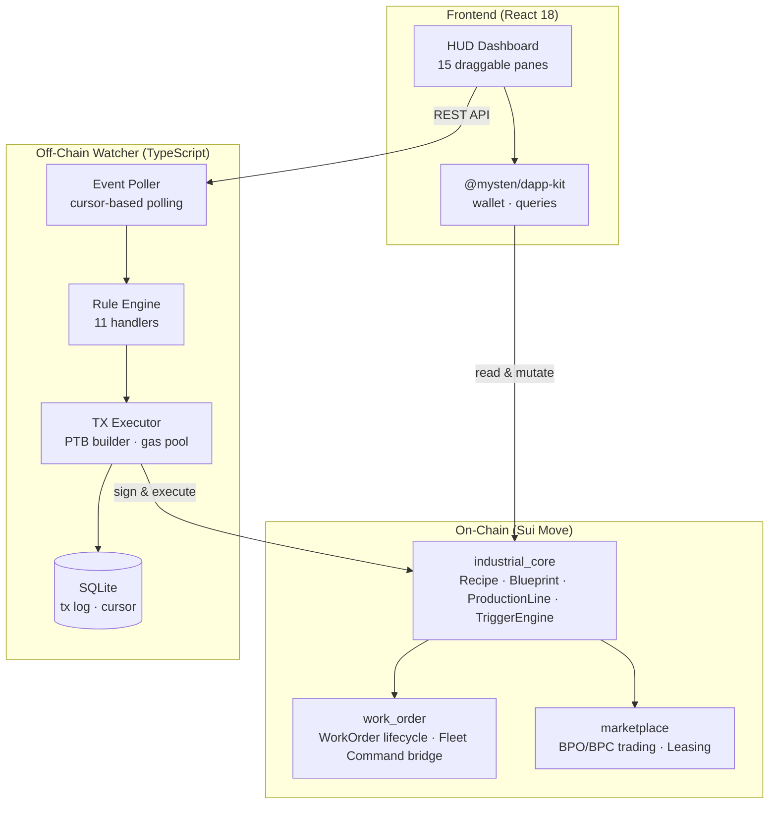

# Industrial Auto OS

> Programmable factory automation for EVE Frontier on Sui — turning star bases into self-managing industrial complexes.

[](https://suiscan.xyz/testnet)
[](#tech-stack)
[](#test-results)

---

## TL;DR

Industrial Auto OS is the **industrial logistics backbone** of the EVE Frontier ecosystem. It transforms player bases into programmable factories with on-chain recipes, blueprint NFTs (BPO/BPC), automated production lines, and a trigger engine that reacts to frontline battle damage in real time. The complete economic loop — from raw materials to finished goods to marketplace trading — runs entirely on Sui Move smart contracts, orchestrated by an off-chain watcher and visualised through an EVE-inspired HUD dashboard.

---

## Architecture



### Core + Satellite Pattern

The contract layer follows a **Core + Satellite** architecture:

- **Core** (`industrial_core`) — immutable physics: recipes, blueprints, production lines, triggers
- **Satellites** (`work_order`, `marketplace`) — mutable business logic: orders, escrow, trading, leasing

This separation allows satellites to be upgraded independently without touching core industrial logic.

---

## Key Features

- **Recipe System** — define input/output material ratios with base duration and fuel cost; recipes are immutable shared objects
- **Blueprint NFTs (BPO/BPC)** — originals grant unlimited production runs with efficiency bonuses; copies are consumable with a fixed run count
- **Production Lines** — shared objects with operator/owner authorisation matrix; deposit materials, start/complete production cycles
- **Trigger Engine** — on-chain threshold rules (e.g. "auto-refine when ore exceeds 500") with cooldown and TOCTOU protection
- **Work Orders + Escrow** — post jobs with SUI rewards; lifecycle: Created → Accepted → Completed/Cancelled with escrow settlement
- **Fleet Command Integration** — battle damage reports trigger automatic resupply work orders
- **Marketplace + Leasing** — list/buy BPOs and BPCs with configurable fees; lease BPOs with time-bound deposit system
- **Off-chain Watcher** — 11 autonomous rule handlers (auto-complete, restock, trigger evaluation, lease forfeiture, etc.)
- **HUD Dashboard** — 15 draggable, resizable panes with EVE Frontier amber theme; real-time data via React Query

---

## Tech Stack

| Layer | Technology |
|-------|-----------|
| Smart Contracts | Sui Move 2024 Edition — 3 packages, 9 modules |
| Off-chain Watcher | TypeScript · @mysten/sui · better-sqlite3 · YAML config |
| Frontend | React 18 · @mysten/dapp-kit · react-grid-layout v2 · Vite |
| Testing | Move test framework · Vitest · Sui CLI E2E |

---

## Testnet Deployment

Deployed on **Sui Testnet** on 2026-03-23.

### Packages

| Package | Package ID |
|---------|-----------|
| industrial_core | `0xe5fa49b0e8cc82b12bf1e26627b9738e57e5431c9d8ccae1c5d8584fb4e5e0a8` |
| work_order | `0x7cef70f7839ee8a86fa5cc488e0aa6c241c126edb2b83e49c487e9cf8aadc029` |
| marketplace | `0xd03d666620eda91417bb3c3479c24dd62e58fc9b2988f5160586e11ba12dee58` |

### Shared Objects

| Object | ID |
|--------|-----|
| WorkOrderBoard | `0x36816fca3c2e3792acb87d62ce441d4f2192dd0f355521e8a80e0479d1e4cf84` |
| Marketplace | `0x6b733e0a70b56a81b397c1e1fd7f39a9150923e9fb50f57b04b614418a455a97` |
| MarketplaceAdminCap | `0x3ed52efc5a301d50a9584687471c3b7a4e5bc6147cc88cc8119a70f71ded6e97` |

Total deployment gas: **~0.158 SUI** (158.4M MIST).

---

## Quick Start

### Prerequisites

- [Sui CLI](https://docs.sui.io/guides/developer/getting-started/sui-install) >= 1.x
- Node.js >= 18
- Testnet SUI — run `sui client faucet` or use the [web faucet](https://faucet.sui.io)

### Build & Test Contracts

```bash
# From the project root
cd packages/industrial_core && sui move build && sui move test
cd ../work_order && sui move build && sui move test
cd ../marketplace && sui move build && sui move test
```

### Start the Watcher

```bash
cd watcher
npm install
cp config.example.yaml config.yaml
# Edit config.yaml — set package IDs, shared object IDs, and keypair path
npm run build && npm start
```

### Start the Frontend

```bash
cd frontend
npm install
# Edit .env — set VITE_INDUSTRIAL_CORE_PACKAGE_ID, etc.
npm run dev
# Open http://localhost:5173
```

---

## Demo

See the [Demo Walkthrough](docs/demo-guide.md) for a step-by-step frontend guide covering the full production-to-marketplace loop.

---

## Project Structure

```
Industrial_Auto_OS/
├── packages/
│   ├── industrial_core/        # Recipe, Blueprint, ProductionLine, TriggerEngine, MockFuel
│   ├── work_order/             # WorkOrder lifecycle + Fleet Command integration
│   └── marketplace/            # BPO/BPC trading + BPO leasing
├── watcher/                    # Off-chain automation daemon
│   ├── src/rules/              # 11 rule handlers (auto-complete, restock, trigger-eval…)
│   ├── src/poller/             # Event polling, inventory monitor, deadline scheduler
│   ├── src/executor/           # PTB builder, tx executor, gas pool
│   ├── src/db/                 # SQLite migrations + queries
│   └── src/api/                # REST API (health, status, tx-log)
├── frontend/                   # React 18 HUD dashboard
│   ├── src/panes/              # 15 modular pane components
│   ├── src/hooks/              # React Query hooks (9 data + layout + toast)
│   ├── src/lib/ptb/            # PTB builders (production, blueprint, workOrder…)
│   ├── src/components/         # PaneChrome, TopBar, StatusBadge, Toast
│   └── src/theme/              # EVE Frontier amber HUD theme (CSS variables)
└── docs/                       # Specs, plans, demo guide
```

---

## Test Results

| Suite | Tests |
|-------|------:|
| Move unit + integration | 165 |
| Watcher (Vitest) | 73 |
| Frontend (Vitest) | 36 |
| E2E smoke (testnet) | 5 |
| **Total** | **279** |

---

## Credits

Built at **HoH SUI HackerHouse Changsha 2026** for the EVE Frontier ecosystem.

---

## Licence

MIT

---

*For the Chinese version of this document, see [README_zh.md](README_zh.md).*
